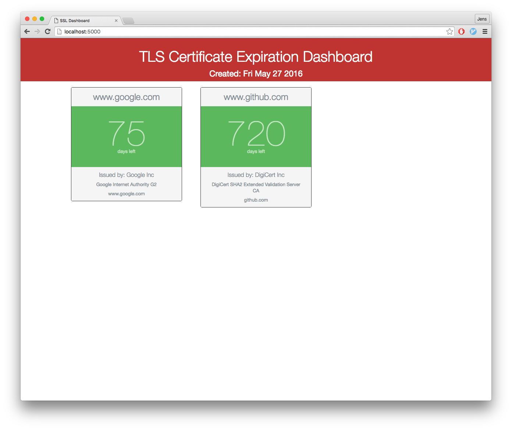

# Certificate dashboard [Original project](https://github.com/cmrunton/tls-dashboard)

Responsive web app that checks when certificates will expire. Serves HTML & JSON so you can consume the service elsewhere.



## Install

```sh
brew install foreman
brew install node
```

## Running Locally

Make sure you have [Node.js](http://nodejs.org/) and the [Heroku Toolbelt](https://toolbelt.heroku.com/) installed.

```sh
$ bin/setup
$ foreman s
```

Note: Running `bin/setup` will reset the .env file. A convenience `run.sh` is provided which will set the port to 5001, copy the saved `.env.bak` to `.env` in case it had been reset, and will start the server.

Environment variables

```sh
MONITORED_CERT_HOSTS="www.mysitethatsupportssl.com, www.othersitessl.com"
```

Your app should now be running on [localhost:5000](http://localhost:5000/).

## Deploying to Heroku

```
$ heroku create
$ git push heroku master
$ heroku config:set MONITORED_CERT_HOSTS="www.mysitethatsupportssl.com, www.othersitessl.com"
$ heroku open
```
or

[](https://heroku.com/deploy)
